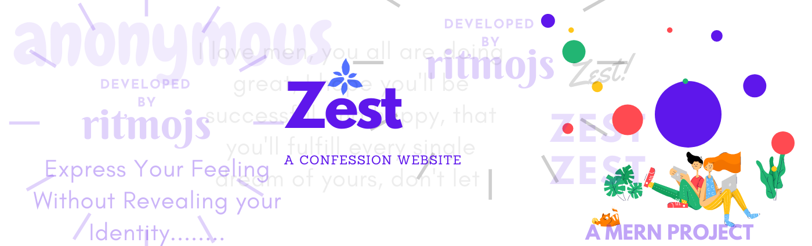
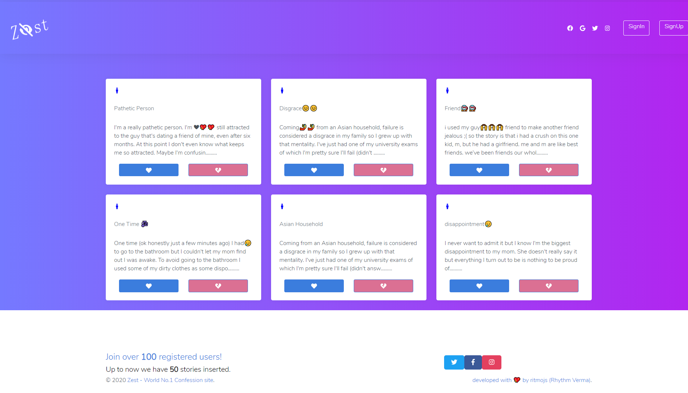
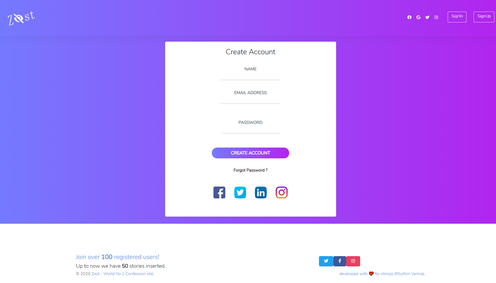
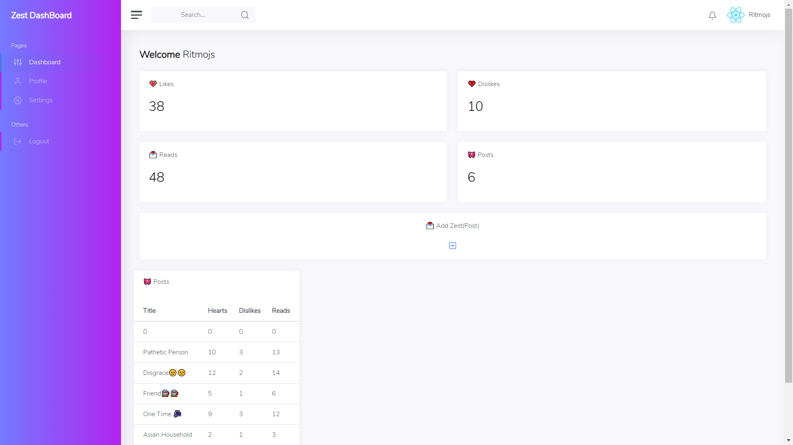

  

<h1 align="center">
  Zest
</h1>

 

## What is Zest?
* Zest is a website where you can confess your feelings without revealing your identity.

# How to Access Zest?

* Visit https://zest-ritmojs.herokuapp.com/

# ScreenShots

# How to Use Zest?

* Step-1: Visit https://zest-ritmojs.herokuapp.com/
* Step-2: Click on the Signup Button (if you are new user or else just signin) .
* Step-3: Now you are on Signup Page ,Fill up the required details.
* Step-4: Click signup Button.
* Step-5: An alert with the successful message will appear.
* Step-6: Click on the Signin Link in the alert above.
* Step-7: Now Signin .
* Step-8: Now you are on your Dashboard ,here you can add Post and see the status of your previous Post.
* Step-9: to add zest click on the '+' button given and then write your feelings.

# ThankYou 

<h1 align="center">
   © Zest 2020
</h1>

